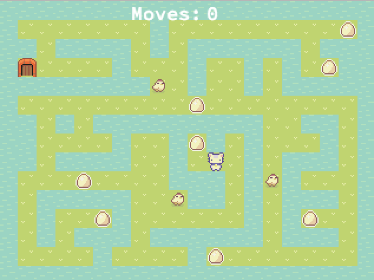
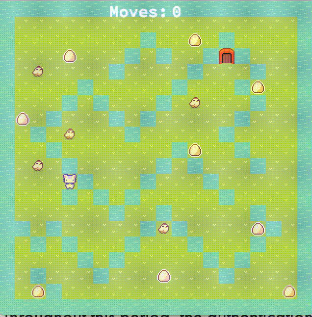

# so_long

# 

### Table of Contents

* [Introduction](#introduction)
* [How it Works](#how-it-works)
* [Extras](#extras)
* [Gameplay](#gameplay)
* [Maps](#maps)
* [Installation](#installation)
* [Summary](#summary)

## Introduction
In this project, we'll code a simple 2D game to get familiar with the mlx library and UI in general. In my case, it will be Rabbit.

### Game Rules
The game we choose must follow a set of rules. The executable ``so_long`` will receive a map as the only argument, and this map will have a ``.ber`` filetype.

The file also must follow these rules:
- Only ``P`` *(player)*, ``1`` *(wall)*, ``0`` *(empty)*, ``C`` *(collectible)*, and ``E`` *(exit)* will be accepted characters in our map (except if you add enemies as bonus)
- The map must be rectangular, i.e. all rows must have the same length
- There must be at least one exit, one player, and one collectible on the map
- The map must be closed, i.e. surrounded by walls

If any of these checks fail, the game must end with ``Error\n`` followed by a custom message.

The goal is for the player(s) to collect all the collectibles on the map before going to an exit in the least possible number of steps

## How it Works
For the graphics part of the project we used a library called [MLX42](https://github.com/codam-coding-college/MLX42). It's fairly basic and somewhat limited, but was still fun to use in the project.



### Cloning the repositories
```shell
git clone https://github.com/LeonorTu/so_long so_long
cd so_long
make
```

### Downoading and building the MLX42 library

```
git clone https://github.com/codam-coding-college/MLX42.git
cd MLX42
cmake -B build # build here refers to the outputfolder.
cmake --build build -j4 # or do make -C build -j4
```

### Usage

```
make                        compiles so_long executable
```
Note: we were not allowed to use multiple threads, thus it is pretty hard to time the speeds of the game. I found that using valgrind on ``linux`` helps slow the game down so it is more similar to the performance in MacOS. Depending on your computer's performance the speed of the game may vary. I hope to learn ways to improve that for future projects. For ``linux``, try always using valgrind as follows: ``valgrind ./so_long <map.ber>``

## Summary
This is a really fun project.
